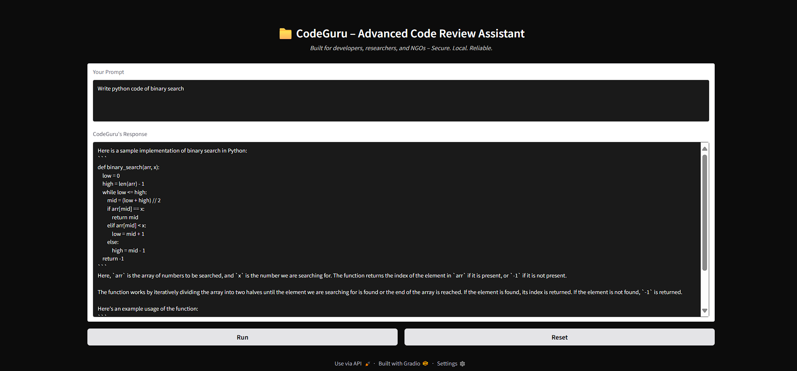

# CodeGuru – Advanced Code Review Assistant

A modern, secure, and local code review chatbot for developers, researchers, and NGOs.  
Powered by **CodeLlama**, **Gradio**, and **LangChain**.

## Features

- Local, private code review for Python, SQL, APIs, and more
- Secure deployment – no cloud required
- Professional, dark-themed interface
- Timestamped conversation history
- Easy chat reset and session management
- Customizable model and UI

---

## # Requirements

- Python 3.8+
- Gradio
- LangChain
- requests
- Ollama or compatible LLM API (for CodeLlama)

**Install dependencies:**
  pip install -r requirements.txt

  
---

## # Model Setup

- Download and install [Ollama](https://ollama.com/) or your preferred local LLM backend.
- Pull the CodeLlama model:
  ollama pull codellama

**Example `modelfile`:**
FROM codellama

PARAMETER temperature 1

SYSTEM """
You are a code teaching assistant named as CodeGuru created by SRISHTI.
Answer all the code related questions being asked.
"""

---

## # Running the App

1. **Start the LLM API server:**
   ollama run codellama

2. **Run the Gradio interface:**
   python app.py

3. The app will be available at:  
`http://127.0.0.1:7860`

---

## # Usage

- Enter your code or question in the prompt box (supports Python, SQL, APIs, etc.).
- The assistant will reply with code explanations, reviews, or suggestions.
- Use the **Reset** button to clear the chat history and start fresh.

---

## # Repository Structure

| File/Folder        | Description                                  |
|--------------------|----------------------------------------------|
| `app.py`           | Main Gradio app and interface logic          |
| `modelfile`        | Model configuration for CodeLlama            |
| `requirements.txt` | Python dependencies                          |
| `model_file.txt`   | (Optional) Additional model info             |
| `ollama`           | Ollama/LLM backend files                     |

---

## # Customization

- **Change the model:** Edit `modelfile` to adjust temperature, system prompt, or switch models.
- **Modify UI:** Update CSS or Gradio components in `app.py` for a different look or layout.
- **Extend Functionality:** Integrate with other APIs or add new features using LangChain.

---

